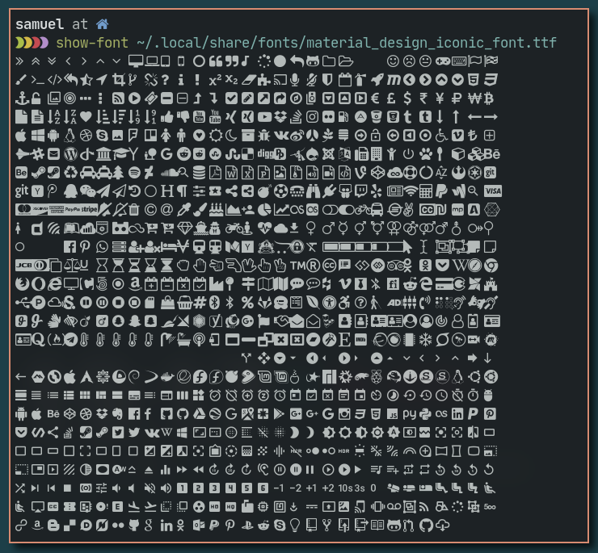

## CLI Font Viewer

A minimal way to view the characters of your fonts.
I wanted something like that to see which icons I had installed in my system so a could choose them to put in a config (like in a polybar module for example).

# Dependencies
`perl`

# OK.. how do put this in my computer?
You can select the contents inside `show-font` and save in a file with the name of `show-font` as well.
Then you will need to provide the permition to execute the script.
```
chmod +x show-font
```
You can move it to a directory inside your PATH as well if you want...

# Usage
```
./show-icons /path/to/font
```

# Example
Disclaimer: the picture below only have "icons" because the font is done with only those glyphs, if a font contais characters such as `A B * &` they will be displayed as well.


In this example I added the `show-font` to my PATH so I could use it from anywhere in my terminal.
